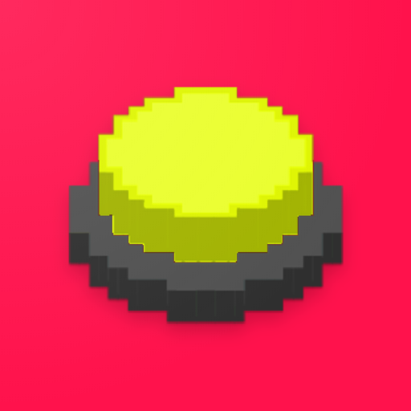
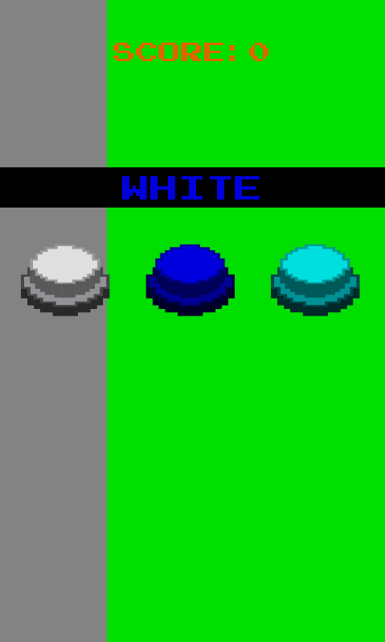
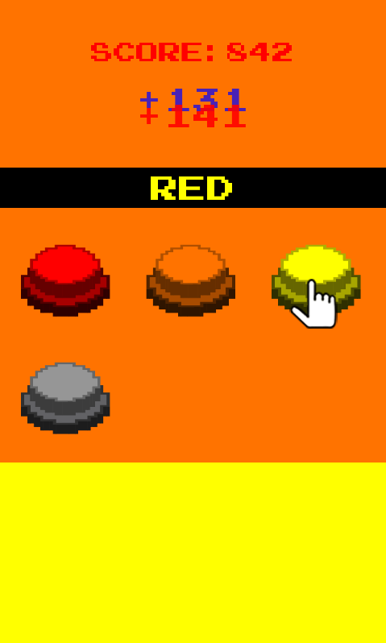
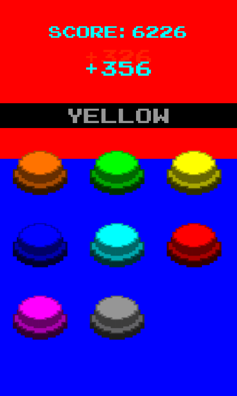
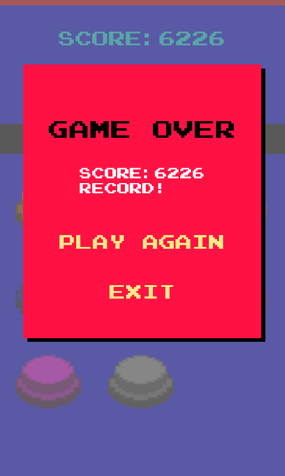

# Rellow

[Gioca ora sul web](https://imaginesoftware.it/open-source-projects/rellow)

Rellow è un gioco di concentrazione in cui devi scegliere il bottone del colore giusto tra quelli disponibili. In cima allo schermo apparirà una parola che ti dice quale colore scegliere — ma non sarà semplice, perché la parola stessa è colorata con un colore diverso.

Man mano che vinci, la difficoltà aumenta: avrai più colori tra cui scegliere e meno tempo per decidere!

## Caratteristiche

- Meccanica basata sull'effetto Stroop
- Difficoltà crescente: più bottoni, meno tempo
- Colori che cambiano a ogni round per distrarti
- Colonna sonora originale
- Grafica vivace in stile pixel art

## Screenshot

---

Il gioco è completamente **gratuito** e open source: non uso librerie di terze parti per tracciare o registrare eventi utente e non ci sono pubblicità.

Ci sono due versioni:

1. Versione CSharp, che trovi nella cartella `CSharp`.

   Ho sviluppato questa versione (Android, Windows...) con queste librerie:
   - [MonoGame](https://github.com/MonoGame)
   - [FbonizziMonoGame](https://github.com/FrancescoBonizzi/FbonizziMonoGame)

2. Versione Web, che puoi giocare [qui](https://imaginesoftware.it/open-source-projects/rellow).

   Ho sviluppato questa versione con [PixiJS](https://pixijs.com/). **Supporterò solo questa**.

---

Se apprezzi il mio lavoro, puoi [offrirmi un espresso](https://www.paypal.com/cgi-bin/webscr?cmd=_donations&business=DTT7P8N3TV7N6&currency_code=EUR&source=url).
